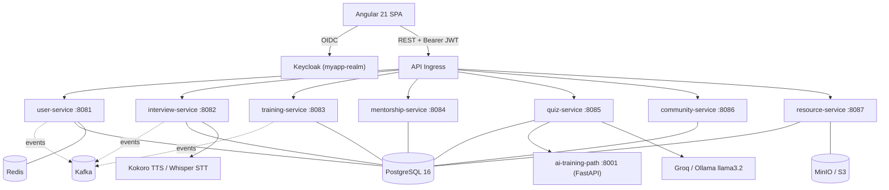

# InterviewPrep TN

> A polyglot **microservices platform** for technical-interview preparation — mock interviews, AI-graded quizzes, training paths with gamification, mentorship matching, a community/careers hub and a learning-resource library — behind a single-sign-on gateway.

[](https://github.com/nacefmoula/interviewprep-tn/actions/workflows/ci.yml)
[](https://github.com/nacefmoula/interviewprep-tn/actions/workflows/codeql.yml)
[](https://github.com/nacefmoula/interviewprep-tn/actions/workflows/gitleaks.yml)
[](LICENSE)


---

## What this project demonstrates

- **Microservices architecture** — 7 independent Spring Boot services + 1 FastAPI AI service, each with its own database, communicating over REST and Kafka events.
- **Production-grade auth** — Keycloak OIDC, JWT resource servers, a canonical role-mapping convention shared across every service, method-level `@PreAuthorize`, and a frontend route guard.
- **Polyglot & AI** — Java 21 / Spring Boot, Python / FastAPI ML path generation, LLM (Groq, Ollama `llama3.2`), Whisper STT and Kokoro TTS for the oral-interview features.
- **Schema discipline** — Flyway-owned schemas with `ddl-auto: validate`; idempotent reconciliation migrations.
- **Hermetic testing** — Testcontainers integration tests (throwaway Postgres/Kafka/Redis) plus infra-free unit tests; green in CI.
- **Security & quality engineering** — a documented, systematic remediation effort (see [Quality & Security](#quality--security-engineering)).
- **CI/CD** — GitHub Actions matrix builds, CodeQL, secret scanning (Gitleaks), IaC scanning (Trivy + kube-linter), containerization and a hybrid OpenStack/Azure/Vercel deployment design.

## Architecture



## Tech stack

| Layer        | Technology |
| ------------ | ---------- |
| Backend      | Spring Boot 3.4 (Java 21), 7 microservices |
| AI / ML      | FastAPI (`ai-training-path`), Whisper (STT), Kokoro (TTS), Ollama `llama3.2`, Groq |
| Frontend     | Angular 21 (standalone components, typed) |
| Auth         | Keycloak (OIDC, realm `myapp-realm`) |
| Data         | PostgreSQL 16, Redis 7, Kafka 7.5, MinIO (S3-compatible) |
| Migrations   | Flyway (pinned 9.22.3 where introduced) |
| Tests        | JUnit 5, Testcontainers, AssertJ |
| CI/CD        | GitHub Actions, CodeQL, Gitleaks, Trivy, kube-linter |
| Deploy       | Docker, Kubernetes (OpenStack), Azure Container Apps, Vercel |

## Services

| Service             | Port  | Purpose                                  |
| ------------------- | ----- | ---------------------------------------- |
| user-service        | 8081  | Users, profiles, RBAC                    |
| interview-service   | 8082  | Mock interview sessions, avatar/TTS      |
| training-service    | 8083  | Training paths, gamification, XP         |
| mentorship-service  | 8084  | Mentorship matching                      |
| quiz-service        | 8085  | Quizzes, oral attempts (Whisper + LLM)   |
| community-service   | 8086  | Community feed, careers wizard           |
| resource-service    | 8087  | Learning-resource library                |
| ai-training-path    | 8001  | ML/LLM-driven training-path generation   |
| frontend (Angular)  | 4200  | Web UI                                   |
| Keycloak            | 8080  | OIDC + realm `myapp-realm`               |

## Quick start (local, Docker)

### 1. Prerequisites
- Docker ≥ 24 + Docker Compose ≥ 2.20
- ~6 GB free RAM (full stack ≈ 4–5 GB)
- Java 21 + Maven only if running a service outside Docker

### 2. Configure environment

```bash
git clone https://github.com/nacefmoula/interviewprep-tn.git
cd interviewprep-tn
cp infra/.env.example infra/.env
```

Set the required keys in `infra/.env` (free tiers, ~30 s each):

| Variable            | Required | Powers                                                           | Get one at |
| ------------------- | -------- | ---------------------------------------------------------------- | ---------- |
| `GROQ_API_KEY`      | **Yes**  | `interview-service`, `community-service` (refuse to start blank)  | https://console.groq.com/keys |
| `GOOGLE_AI_API_KEY` | **Yes**  | Training-coach chatbot (UI disables gracefully if blank)          | https://aistudio.google.com/app/apikey |
| `MAIL_USERNAME` / `MAIL_PASSWORD` | Optional | Real SMTP (else MailHog catches mail)              | Mailtrap sandbox |

> ⚠️ **Postgres password is baked into the data volume on first `up`.** Pick it before the first `docker compose up`; to reset, `docker compose down -v` (wipes DB data).

### 3. Start the stack

```bash
cd infra
docker compose up -d
docker compose ps      # wait for healthy / Up
```

First boot ≈ 90 s (Keycloak imports the realm).

### 4. Verify

| URL | Shows |
| --- | ----- |
| http://localhost:4200 | Angular frontend |
| http://localhost:8080/admin/ | Keycloak admin console |
| http://localhost:8081/actuator/health | user-service health |
| http://localhost:8025 | MailHog inbox |

### 5. Seed test users (one-time)

```bash
infra/scripts/seed-test-users.sh
```

Creates (idempotent):
- `admin@test.com` / `admin123` — `ROLE_ADMIN`
- `user@test.com` / `user123` — `ROLE_USER`
- `mentor@test.com` / `mentor123` — `ROLE_MENTOR`

## Testing

```bash
# One backend service (unit + Testcontainers integration; needs Docker)
cd user-service && ./mvnw test

# Frontend production build + lint
cd frontend && npm ci && npx ng build --configuration production && npm run lint
```

- **Integration tests** use Testcontainers — a throwaway Postgres/Kafka/Redis per run (`AbstractIntegrationTest`); no shared infra, reproducible anywhere with Docker.
- **Unit tests** (security-critical paths: JWT role mapping, exception handlers) are infra-free and run without Docker.
- CI runs the full suite on every PR — see the badges above.

## Quality & Security Engineering

This codebase went through a **systematic, documented audit-and-remediation programme** — the kind of work this internship is about. Full backlog, severities, decisions and rationale: [`docs/quality/CODE_AUDIT.md`](docs/quality/CODE_AUDIT.md).

Highlights:
- **Exception handlers** hardened so 5xx responses never leak `ex.getMessage()` / class names.
- **Authorization** holes closed (paid AI endpoints now authenticated; ownership checks; admin gating).
- **Outbound HTTP** given connect/read timeouts + bounded retry (no thread-starvation DoS).
- **JWT role mapping** unified across services via one canonical normalization (fixed real bugs: double-prefixing, case mismatch).
- **Schema integrity** — Flyway made the sole schema owner with idempotent reconciliation; risky migrations explicitly assessed, not blindly "fixed".
- **Secrets** removed from source; this repository starts from **fresh git history** so no credential ever appears in the log.
- **Tests** added as hermetic regression guards for the security fixes.

Decisions were made with engineering judgement — risky changes (e.g. consolidating already-applied migrations) were **deliberately deferred with written rationale** rather than shipped recklessly.

## Project status

| Area | Status |
| ---- | ------ |
| Backend builds + tests | ✅ green in CI (all services, Testcontainers) |
| Frontend production build + lint | ✅ green |
| Local one-command run (`docker compose`) | ✅ works |
| Live cloud deployment | ⚙️ designed & scripted; requires your own DockerHub/Vercel/Azure secrets (see Deployment) |

## Deployment

Production deployment is hybrid (design + automation included; secrets are **not** committed):

| Component | Platform |
| --------- | -------- |
| Spring services, Keycloak, Postgres, Redis, Kafka, MinIO | OpenStack Kubernetes (`piclouddoom`) |
| AI services (`ai-training-path`, Whisper, Kokoro, Ollama) | Azure Container Apps |
| Angular frontend | Vercel |
| Container images | DockerHub |

Deploy workflows (`build-and-push`, `deploy-k8s`, `deploy-aca`, `vercel-*`) are **manual (`workflow_dispatch`)** in this repository so CI stays green without credentials; add the documented secrets to enable automation. Pipeline diagram, workflow index and secret matrix: [`docs/cicd/README.md`](docs/cicd/README.md). OpenStack cluster IaC: [`infra/openstack/heat-cluster.yaml`](infra/openstack/heat-cluster.yaml).

## Repository layout

```
.
├── infra/                # docker-compose, Keycloak realm, init SQL, .env.example
├── frontend/             # Angular 21 app
├── {user,interview,training,mentorship,quiz,community,resource}-service/
├── ai-training-path/     # FastAPI ML service
├── kokoro/               # TTS service
├── k8s/                  # Kubernetes manifests + ingress
├── postman/              # API collections
├── docs/                 # CI/CD runbook, CODE_AUDIT, feature docs
└── .github/workflows/    # CI, CodeQL, Gitleaks, IaC scan, deploy (manual)
```

## Branch strategy

- `main` — released, always green.
- `develop` — integration branch for ongoing work.
- `feature/*` — one branch per change → PR into `develop` → merged to `main` on release.

## License

[MIT](LICENSE) © 2026 Nacef Moula
